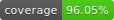

# rollup-plugin-copy-assets

  [](https://www.npmjs.com/package/rollup-plugin-copy-assets)

Copy additional assets into the output directory of your rollup bundle.

## Installation

```shell
# add with yarn
yarn add --dev rollup-plugin-copy-assets

# or npm
npm install --save-dev rollup-plugin-copy-assets
```

## Usage

```js
// rollup.config.js
import copy from "rollup-plugin-copy-assets";

export default {
  input: "src/index.js",
  output: {
    file: "dist/bundle.js",
    format: "cjs",
  },
  plugins: [
    copy({
      assets: [
        // You can include directories
        "src/assets",
        // You can also include files
        "src/external/buffer.bin",
      ],
    }),
  ],
};
```

On final bundle generation the provided files will be copied over into the output folder of your rollup bundle, maintaining the original hierarchy and relativity to the input file:

```bash
# Source directory structure
src/
- index.js
- assets/
  - some-library-needing-special-treatment.js
- external/
  - buffer.bin

# Output directory structure
dist/
- bundle.js
- assets/
  - some-library-needing-special-treatment.js
- external/
  - buffer.bin
```

### Options

- `assets`: **(required)** An array of paths to copy. Accepts files as well as directories.

## License

MIT
